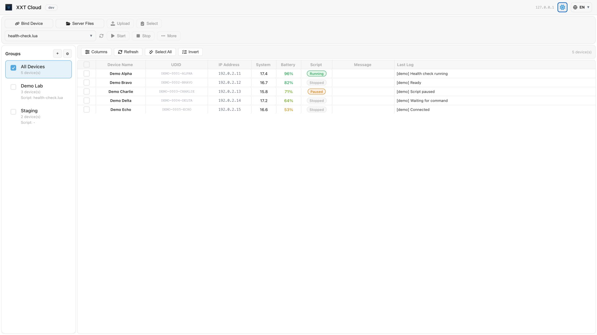

# XXTCloudControl

[简体中文](../../README.md) | [繁體中文](README.zh-TW.md) | [English](README.en-US.md) | [日本語](README.ja-JP.md) | [한국어](README.ko-KR.md) | [Tiếng Việt](README.vi-VN.md) | [Español](README.es-ES.md) | Português (Brasil) | [Русский](README.ru-RU.md) | [Français](README.fr-FR.md) | [Deutsch](README.de-DE.md)

Servidor de controle em nuvem (WebSocket + frontend estático) e painel de administração para XXTouch 1.3.8-20260122000000 e versões posteriores.  
A implementação do protocolo no dispositivo está em `/var/mobile/Media/1ferver/bin/open-cloud-control-client.lua`.  

<picture>
  <source media="(prefers-color-scheme: dark)" srcset="../../site/public/screenshot-001-en-dark.png">
  <source media="(prefers-color-scheme: light)" srcset="../../site/public/screenshot-001-en.png">
  
</picture>

## Lançamentos

- Página oficial de download (GitHub Pages): [https://xxtccc-releases.xxtouch.app/](https://xxtccc-releases.xxtouch.app/)
- Lançamentos para todas as plataformas: [https://github.com/havonz/XXTCloudControl/releases](https://github.com/havonz/XXTCloudControl/releases)
- Recomendamos baixar primeiro `XXTCloudControl-<YYYYMMDDHHMM>.zip` nos arquivos do Release. Extraia-o e execute o binário correspondente ao seu sistema operacional.


## Estrutura do projeto

- `server/` - Serviço backend WebSocket/HTTP (ponto de entrada: `server/main.go`)
- `frontend/` - Painel de administração SolidJS; código-fonte em `frontend/src/` e saída da compilação em `frontend/dist/`
- `device-client/` - Biblioteca cliente WebSocket em Lua
- `XXT 云控设置.lua` - Script original de configuração do dispositivo em chinês simplificado (grava o endereço de controle em nuvem)
- `device-scripts/settings/` - Scripts independentes de configuração do dispositivo em 11 idiomas
- `docs/i18n/` - Traduções completas do README
- `build.sh` - Compila e empacota o servidor e o frontend para várias plataformas
- `build/` - Diretório de saída da compilação
- `server/data/` - Diretório de dados em tempo de execução (`data_dir=./data` por padrão, relativo ao diretório de inicialização)

## Recursos

- Comunicação WebSocket em tempo real e sincronização do estado dos dispositivos
- Implantação integrada de frontend e backend; o servidor pode hospedar o frontend estático diretamente
- Controle em lote: scripts, toque, teclas, reinicialização/respring e área de transferência
- Controle de desktop WebRTC em tempo real com travessia TURN integrada opcional
- Grupos de dispositivos e configuração de scripts por meio de formulários dinâmicos do FormRunner
- Repositório de arquivos no servidor (scripts/files/reports) e transferências bidirecionais dispositivo/servidor (WS para arquivos pequenos e tokens HTTP para arquivos grandes)
- Proxy `control/http` para as APIs HTTP locais do dispositivo, incluindo APIs WebRTC

## Início rápido

### Baixar e executar um binário (recomendado)

1. Abra a página de lançamentos e baixe o `XXTCloudControl-<YYYYMMDDHHMM>.zip` mais recente:  
   [https://github.com/havonz/XXTCloudControl/releases](https://github.com/havonz/XXTCloudControl/releases)
2. Extraia o arquivo, entre no diretório e execute o binário correspondente ao seu sistema operacional:
   ```bash
   # macOS (Apple Silicon 示例)
   chmod +x ./xxtcloudserver-darwin-arm64
   ./xxtcloudserver-darwin-arm64

   # Linux (amd64 示例)
   chmod +x ./xxtcloudserver-linux-amd64
   ./xxtcloudserver-linux-amd64

   # Windows (PowerShell)
   .\xxtcloudserver-windows-amd64.exe
   ```
3. Na primeira inicialização, o servidor cria `xxtcloudserver.json` no diretório atual e exibe uma senha aleatória (mostrada apenas uma vez).
4. Abra `http://<endereço-do-servidor>:46980` no navegador para entrar no painel de gerenciamento.
5. Se esquecer a senha, redefina-a no mesmo diretório e reinicie o serviço:
   ```bash
   # macOS (Apple Silicon 示例)
   ./xxtcloudserver-darwin-arm64 -set-password 12345678

   # Linux (amd64 示例)
   ./xxtcloudserver-linux-amd64 -set-password 12345678

   # Windows (PowerShell)
   .\xxtcloudserver-windows-amd64.exe -set-password 12345678
   ```

### Implantação com Docker

#### Início rápido (recomendado)

```bash
docker pull havonz/xxtcloudcontrol
docker run --rm \
  -v "$PWD/xxtcc-data:/app/data" \
  havonz/xxtcloudcontrol \
  -config /app/data/xxtcloudserver.json -set-password 12345678
docker run -d --name xxtcloudcontrol \
  -p 46980:46980 \
  -p 43478:43478/tcp -p 43478:43478/udp \
  -v "$PWD/xxtcc-data:/app/data" \
  -e XXTCC_CONFIG=/app/data/xxtcloudserver.json \
  -e XXTCC_TURN_PUBLIC_IP="" \
  -e XXTCC_TURN_PUBLIC_ADDR="" \
  havonz/xxtcloudcontrol
```

> Dica: se você não montar um diretório de dados, os dados e a configuração serão criados em `/app/data` dentro do contêiner por padrão.
> Ao iniciar, o serviço lê primeiro o arquivo de configuração e depois aplica as substituições das variáveis de ambiente. As variáveis de ambiente não são gravadas automaticamente no arquivo de configuração.
> Consulte o exemplo de [docker-compose.yml](../../docker-compose.yml) para ver os nomes das variáveis de ambiente.

#### Implantar com docker-compose.yml

[docker-compose.yml](../../docker-compose.yml)

```bash
mkdir -p XXTCloudControl && cd XXTCloudControl
curl -L -o docker-compose.yml https://raw.githubusercontent.com/havonz/XXTCloudControl/main/docker-compose.yml
docker compose up -d
```

### Compilação e empacotamento para produção (a partir do código-fonte)

> Dependências: `go`, `npm` e `zip`

```bash
bash build.sh
```

Os artefatos são gerados em `build/`, incluindo os binários de cada plataforma e o pacote zip:
```
build/
├── xxtcloudserver-<os>-<arch>[.exe]
├── ...
└── XXTCloudControl-<YYYYMMDDHHMM>.zip
```

A estrutura do diretório após a extração é a seguinte:
```
XXTCloudControl/
├── frontend/
├── xxtcloudserver-darwin-arm64
├── xxtcloudserver-linux-amd64
└── xxtcloudserver-windows-amd64.exe
```
Execute, nesse diretório, o binário correspondente ao seu sistema para hospedar o frontend automaticamente (`frontend_dir=./frontend` por padrão).

### Compilar imagens Docker

> Dependência: `docker` com o buildx ativado

```bash
bash build-docker.sh
```

Os artefatos são gerados em `build/`:
```
XXTCloudControl-docker-<YYYYMMDDHHMM>-linux-amd64.tar
XXTCloudControl-docker-<YYYYMMDDHHMM>-linux-arm64.tar
```

### Modo de desenvolvimento

1. Inicie o backend:
   ```bash
   cd server
   go run .
   ```
   Na primeira inicialização, o servidor cria `xxtcloudserver.json` no diretório atual e exibe uma senha aleatória (mostrada apenas uma vez).

2. Inicie o servidor de desenvolvimento do frontend:
   ```bash
   cd frontend
   npm install
   npm run dev
   ```
   Abra `http://localhost:3000` e informe o endereço do servidor, a porta (`46980` por padrão) e a senha na página de login.
   
   > Dica: por padrão, o servidor de desenvolvimento escuta em `127.0.0.1:3000` e encaminha `/api` para `http://127.0.0.1:46980`. Se o backend estiver em outro host, ajuste `frontend/vite.config.ts` ou use um proxy reverso.

> Observação: ao executar `go run .` no diretório `server`, o valor padrão de `frontend_dir` é `./frontend` e não aponta automaticamente para `../frontend/dist`. Para que o backend hospede o frontend, defina `frontend_dir` na configuração ou use a estrutura de diretórios do pacote.

### Alterar a senha

```bash
./xxtcloudserver-<os>-<arch> -set-password 12345678
```

Ou, ao executar a partir do código-fonte:
```bash
cd server
go run . -set-password 12345678
```

## Opções comuns de linha de comando

- `-config <path>`: especifica o caminho do arquivo de configuração (por padrão, usa `xxtcloudserver.json` no diretório de inicialização)
- `-set-password <pwd>`: altera a senha do controlador
- `-set-turn-ip <ip>`: define o IP público do TURN e o ativa
- `-set-turn-port <port>`: define a porta de escuta do TURN e o ativa
- `-v` / `-h`: mostra a versão / ajuda

## Configuração

Arquivo de configuração padrão: `xxtcloudserver.json` (criado no diretório de inicialização)

```json
{
  "port": 46980, // WebSocket 服务端口
  "passhash": "hex-string", // 密码的 HMAC-SHA256 哈希值
  "ping_interval": 15, // 服务端发送 WebSocket PING 心跳的间隔（秒）
  "ping_timeout": 10, // 设备连续未响应次数阈值，超过则断开连接
  "state_interval": 45, // 服务端请求设备状态 (app/state) 的间隔（秒）
  "frontend_dir": "./frontend", // 前端文件目录
  "data_dir": "./data", // 服务端数据目录
  "tlsEnabled": false, // 是否启用 TLS（HTTPS/WSS）
  "tlsCertFile": "./certs/server.crt", // TLS 证书文件路径
  "tlsKeyFile": "./certs/server.key", // TLS 私钥文件路径
  "turnEnabled": true, // 是否启用 TURN 服务器
  "turnPort": 43478,   // TURN 服务器监听端口（默认 43478）
  "turnPublicIP": "你的公网IP", // 公网 IP（需验证格式）
  "turnPublicAddr": "turn.example.com", // 公网地址（IP 或域名，无验证）
  "turnRealm": "xxtcloud", // TURN realm
  "turnSecretKey": "你的密钥", // TURN REST 密钥（留空会自动生成）
  "turnCredentialTTL": 86400, // TURN 凭据有效期（秒）
  "turnRelayPortMin": 49152, // TURN 服务器中继端口范围起始
  "turnRelayPortMax": 65535, // TURN 服务器中继端口范围结束
  "customIceServers": [] // 自定义 ICE 服务器列表（见下文）
}
```

- `passhash` é o resultado de `hmacSHA256("XXTouch", password)`, não a senha em texto simples.
- `ping_interval` controla a frequência do heartbeat. Nesse intervalo, o servidor envia quadros WebSocket PING aos dispositivos para verificar se estão online.
- `state_interval` controla a frequência de atualização do estado. Nesse intervalo, o servidor envia uma solicitação `app/state` aos dispositivos para obter o estado mais recente.
- `ping_timeout` é o limite de respostas consecutivas ausentes, medido em ciclos de `ping_interval`. O servidor desconecta o dispositivo quando esse limite é excedido.
- Por padrão, `data_dir` contém dados persistentes como `scripts/`, `files/`, `reports/`, dados de grupos e configurações de scripts.
- Todos os caminhos da configuração são relativos ao diretório de inicialização. Ao iniciar no diretório `server/`, o valor padrão `data_dir=./data` corresponde a `server/data/`.
- `turnEnabled` é `true` por padrão, mas o servidor TURN integrado só é iniciado quando `turnPublicIP` ou `turnPublicAddr` está configurado.

## Configuração de travessia WebRTC (TURN)

Para permitir o controle da área de trabalho em tempo real por redes externas, o servidor inclui um servidor TURN com suporte a UDP e TCP.

### Configuração do endereço TURN

O servidor aceita duas formas de configurar o endereço público:

| Campo | Formato | Validação | Caso de uso |
|------|------|------|----------|
| `turnPublicIP` | Somente endereço IPv4 | Validado com `net.ParseIP()` | Há um IP público fixo |
| `turnPublicAddr` | IPv4 ou nome de domínio | O domínio é resolvido por DNS automaticamente | Acesso por nome de domínio |

> [!IMPORTANT]
> **Somente IPv4**: no momento, o servidor TURN aceita apenas endereços IPv4. Um endereço IPv6 ou um domínio que tenha apenas registro AAAA impedirá a inicialização.
>
> Se ambos forem configurados, `turnPublicIP` terá prioridade. Basta configurar um deles para ativar o TURN integrado.

Exemplo de configuração:

```json
// 方式 1: 使用 IP
{
  "turnEnabled": true,
  "turnPublicIP": "203.0.113.1"
}

// 方式 2: 使用域名
{
  "turnEnabled": true,
  "turnPublicAddr": "turn.example.com"
}
```

### Servidores ICE personalizados

Além do serviço TURN integrado, você pode configurar servidores STUN/TURN externos. Isso é útil quando:

- Você prefere usar um serviço TURN de terceiros, como o [Metered](https://www.metered.ca/tools/openrelay/), sem ativar o TURN local
- Você quer combinar o TURN local com um serviço externo para melhorar a conectividade

> [!WARNING]
> **Aviso de segurança**: a configuração em `customIceServers`, incluindo `username` e `credential`, é enviada ao dispositivo durante a conexão WebRTC e **não é confidencial**. Use um serviço TURN com credenciais temporárias ou certifique-se de que as credenciais possam ser compartilhadas publicamente.

Exemplo de configuração:

```json
{
  "turnEnabled": false,
  "customIceServers": [
    {
      "urls": ["stun:stun.relay.metered.ca:80"]
    },
    {
      "urls": ["turn:global.relay.metered.ca:80"],
      "username": "your-username",
      "credential": "your-credential"
    },
    {
      "urls": ["turn:global.relay.metered.ca:80?transport=tcp"],
      "username": "your-username",
      "credential": "your-credential"
    },
    {
      "urls": ["turn:global.relay.metered.ca:443"],
      "username": "your-username",
      "credential": "your-credential"
    },
    {
      "urls": ["turns:global.relay.metered.ca:443?transport=tcp"],
      "username": "your-username",
      "credential": "your-credential"
    }
  ]
}
```

**Comportamento das combinações:**

| TURN local | Servidores ICE personalizados | Resultado |
|-----------|-------------------|------|
| Ativado | Nenhum | Usa somente o TURN local |
| Desativado | Configurados | Usa somente os servidores ICE personalizados |
| Ativado | Configurados | **Combina** o TURN local com os servidores ICE personalizados |
| Desativado | Nenhum | Sem servidores ICE; o WebRTC tenta apenas uma conexão direta |

### Comandos de configuração rápida

```bash
# 设置公网 IP 并启用
./xxtcloudserver -set-turn-ip 1.2.3.4

# (可选) 设置监听端口 (默认 43478)
./xxtcloudserver -set-turn-port 3478
```

> [!TIP]
> Quando `turnSecretKey` está vazio, uma chave temporária é criada automaticamente na inicialização e muda após uma reinicialização. Configure-a manualmente se precisar de credenciais TURN estáveis.

### Configuração de firewall para administradores

O administrador do servidor deve abrir as seguintes portas no grupo de segurança da nuvem ou no firewall:

| Intervalo de portas | Protocolo | Finalidade |
|----------|------|------|
| `46980` (ou personalizada) | **TCP** | **Serviço de controle em nuvem** (API e WebSocket) |
| `43478` (ou personalizada) | **UDP e TCP** | Controle, negociação e fallback do WebRTC TURN |
| `49152 - 65535` | **UDP** | Retransmissão de mídia em tempo real do WebRTC TURN |

> [!TIP]
> A retransmissão de mídia dá preferência a UDP. Quando o tráfego UDP é muito restrito, o WebRTC usa TCP automaticamente (porta 43478) para manter a transmissão da área de trabalho.

## Configuração de TLS/HTTPS (opcional)

O servidor oferece suporte direto a HTTPS/WSS, permitindo conexões criptografadas sem um proxy reverso. Ele também é compatível com a implantação atrás de proxies reversos como Nginx e Caddy.

### 1) Configurar TLS

Defina os seguintes valores em `xxtcloudserver.json`:

```json
{
  "tlsEnabled": true,
  "tlsCertFile": "./certs/server.crt",
  "tlsKeyFile": "./certs/server.key"
}
```

### 2) Gerar um certificado de teste local

```bash
mkdir -p certs
openssl req -x509 -newkey rsa:4096 -sha256 -days 365 -nodes \
  -keyout certs/server.key -out certs/server.crt \
  -subj "/CN=localhost" \
  -addext "subjectAltName=DNS:localhost,IP:127.0.0.1"
```

> [!WARNING]
> Certificados autoassinados são apropriados apenas para testes locais. Em produção, use um certificado emitido pela Let's Encrypt ou por outra autoridade certificadora.

### 3) Modo de proxy reverso

Ao usar um proxy reverso como Nginx ou Caddy, o servidor pode continuar em modo HTTP enquanto o proxy encerra o TLS. Nesse caso, o script de vinculação detecta o protocolo pelo header `X-Forwarded-Proto` e gera o endereço `wss://` correto.

Exemplo de configuração do Nginx:

```nginx
server {
    listen 443 ssl;
    server_name your-domain.com;
    
    ssl_certificate /path/to/cert.pem;
    ssl_certificate_key /path/to/key.pem;
    
    location / {
        proxy_pass http://127.0.0.1:46980;
        proxy_set_header X-Forwarded-Proto $scheme;
    }
    
    location /api/ws {
        proxy_pass http://127.0.0.1:46980;
        proxy_http_version 1.1;
        proxy_set_header Upgrade $http_upgrade;
        proxy_set_header Connection "upgrade";
        proxy_set_header X-Forwarded-Proto $scheme;
    }
}
```

## Vinculação de dispositivos

1. Execute o script original em chinês simplificado `XXT 云控设置.lua` na raiz do repositório ou escolha o script independente do seu idioma em `device-scripts/settings/`. Informe `ws://<host>:46980/api/ws` (use `wss://` com TLS ou proxy reverso).
2. Como alternativa, baixe um script de vinculação gerado automaticamente:
   `http://<host>:46980/api/download-bind-script?host=<host>&port=46980`  
   Adicione `proto=https` para forçar a geração de um endereço `wss://`. Com um proxy reverso, o protocolo também pode ser identificado automaticamente por `X-Forwarded-Proto`.
3. Ou chame manualmente a API local do dispositivo:
   ```http
   PUT http://127.0.0.1:46952/api/config

   {
     "cloud": {
       "enable": true,
       "address": "ws://<host>:46980/api/ws"
     }
   }
   ```

Para desativar o controle em nuvem, defina `enable` como `false`.

`device-scripts/settings/` contém scripts para 11 locales: `zh-CN`, `zh-TW`, `en-US`, `ja-JP`, `ko-KR`, `vi-VN`, `es-ES`, `pt-BR`, `ru-RU`, `fr-FR` e `de-DE`. Cada arquivo funciona de forma independente e não depende de arquivos de outros idiomas.

## Convenções de WebSocket

- Endereço WebSocket: `ws://<host>:<port>/api/ws` (use `wss://` com TLS ou proxy reverso)
- As mensagens do controlador devem conter `ts`, `nonce` e `sign`. O timestamp pode ter uma diferença de até ±60 segundos, e um `nonce` não pode ser reutilizado dentro de 120 segundos.

## Algoritmo de autenticação e assinatura (HTTP e WebSocket)

A autenticação não usa um token fixo. Em vez disso, usa assinaturas dinâmicas de curta duração: cada solicitação do cliente inclui o timestamp atual em segundos como `ts`, um `nonce` aleatório e a assinatura `sign`. O servidor valida a assinatura dentro da janela de tempo permitida e rejeita nonces repetidos.

### 1) Senha e passhash

O arquivo de configuração do servidor `xxtcloudserver.json` armazena `passhash`, e não a senha em texto simples:

- `passhash = HMAC-SHA256(key="XXTouch", message=password)`, resultando em uma string hexadecimal de 64 caracteres.

### 2) Como calcular sign

A assinatura do controlador usa `passhash` como HMAC key e aplica HMAC à string-base normalizada:

#### String-base de HTTP

```
base = ts "\n" nonce "\n" METHOD "\n" PATH_AND_QUERY "\n" bodyHash
```

- `METHOD`: método da solicitação (GET/POST/PUT/DELETE…)
- `PATH_AND_QUERY`: `path` + query ordenada (sem `ts`, `nonce` e `sign`)
- `bodyHash`：
  - Body comum: valor hexadecimal de `SHA-256(bodyBytes)`
  - Body vazio ou multipart (`multipart/form-data`) não participa por enquanto: `bodyHash = ""`

#### String-base de WebSocket

```
base = ts "\n" nonce "\n" type "\n" bodyHash
```

- `type`: tipo da mensagem (por exemplo, `control/devices`)
- `bodyHash`: valor hexadecimal de `SHA-256` aplicado à representação JSON de `body`; se não houver body, use uma string vazia

Assinatura final:

- `sign = HMAC-SHA256(key=passhash, message=base)`, resultando em uma string hexadecimal.

> Observação: aqui, `key=passhash` significa **a própria string hexadecimal de passhash**, usada no HMAC como bytes da string. Não decodifique o valor hexadecimal em 32 bytes antes do cálculo.

### 3) Regras de validação do servidor

- Diferença de tempo permitida: `ts` deve estar dentro de `±60` segundos do horário atual do servidor.
- Um `nonce` não pode ser reutilizado dentro de `120` segundos; a repetição é tratada como replay.
- Uma falha de validação retorna `401 Unauthorized` em HTTP ou encerra imediatamente a conexão para uma mensagem do controlador via WebSocket.

### 4) Autenticação da HTTP API

Com exceção do download do script de vinculação por HTTP, todas as HTTP APIs exigem uma assinatura com o mesmo algoritmo usado no WebSocket:

- Caminhos protegidos: todos os caminhos `/api/*`
- Exceções:
  - `/api/download-bind-script` (mantido sem assinatura conforme o requisito)
  - `/api/config` (configuração de inicialização do frontend)
  - `/api/control/info` (saída da configuração em JSON)
  - `/api/ws` (o handshake de upgrade do WebSocket não usa autenticação HTTP; as mensagens do controlador continuam exigindo assinatura)
  - `/api/transfer/download/:token` (download com token temporário)
  - `/api/transfer/upload/:token` (upload com token temporário)
  - Solicitações preflight `OPTIONS` (CORS)

Uma solicitação HTTP pode enviar a autenticação de uma destas duas formas:

1. **Headers da solicitação (recomendado)**
   - `X-XXT-TS: <ts>`
   - `X-XXT-Nonce: <nonce>`
   - `X-XXT-Sign: <sign>`

2. **Parâmetros de query (para downloads, `window.open`, `img` e outros casos em que é difícil adicionar um header personalizado)**
   - `?ts=<ts>&nonce=<nonce>&sign=<sign>`

Exemplo:

```bash
# 查询分组（header 方式）
curl -sS \
  -H "X-XXT-TS: 1700000000" \
  -H "X-XXT-Nonce: <nonce>" \
  -H "X-XXT-Sign: <hex-sign>" \
  http://127.0.0.1:46980/api/groups

# 下载服务器文件（query 方式）
curl -L -o out.bin \
  "http://127.0.0.1:46980/api/server-files/download/scripts/demo.lua?ts=1700000000&nonce=<nonce>&sign=<hex-sign>"
```

### Formato comum das mensagens do controlador

```json
{
  "ts": 1700000000,
  "nonce": "<nonce>",
  "sign": "hex-sign",
  "type": "control/command|control/commands|control/devices|control/refresh",
  "body": {}
}
```

### Proxy HTTP (`control/http`)

O controlador pode enviar `control/http` por WebSocket para encaminhar uma solicitação HTTP ao dispositivo, onde ela é executada por `http.request`. Esse recurso é usado principalmente com APIs relacionadas ao WebRTC.

```json
{
  "ts": 1700000000,
  "nonce": "<nonce>",
  "sign": "hex-sign",
  "type": "control/http",
  "body": {
    "devices": ["udid1"],
    "requestId": "uuid",
    "method": "POST",
    "path": "/api/webrtc/start",
    "query": {},
    "headers": { "Content-Type": "application/json" },
    "body": "base64-json",
    "port": 46952
  }
}
```

> Observação: `body` deve ser codificado em base64. Quando a solicitação é para `/api/webrtc/start` e o TURN está ativado, o servidor insere `iceServers` automaticamente.

### Conexão do dispositivo

O dispositivo envia `app/state` e informa seu identificador exclusivo em `body.system.udid`.
Dispositivos compatíveis com o teclado de hardware global também declaram a capacidade opcional a seguir. Se o campo estiver ausente ou não for `true`, o controlador não enviará comandos de teclado de hardware:

```json
{
  "type": "app/state",
  "body": {
    "cloudControl": {
      "protocolVersion": 2,
      "features": {
        "globalHardwareKeyboard": true
      }
    },
    "system": {
      "udid": "udid1"
    }
  }
}
```

O controlador envia `key/global-keyboard` por `control/command`, e o dispositivo responde com o mesmo tipo. `owner` identifica uma sessão de controle em tempo real; o dispositivo permite que apenas o owner correspondente desconecte o teclado:

```json
{
  "devices": ["udid1"],
  "type": "key/global-keyboard",
  "body": {
    "action": "status",
    "owner": "controller-session-id"
  }
}
```

`action` aceita `status`, `connect` e `disconnect`. O `body` da resposta contém `action`, `owner`, `supported`, `ok` e `connected`, e pode incluir `message` em caso de falha.

### Desconexão do dispositivo

O servidor notifica o controlador:
```json
{
  "type": "device/disconnect",
  "body": "udid"
}
```

### Lista de dispositivos

```json
{
  "ts": 1700000000,
  "nonce": "<nonce>",
  "sign": "hex-sign",
  "type": "control/devices"
}
```

Resposta:
```json
{
  "type": "control/devices",
  "body": {
    "udid1": {},
    "udid2": {}
  }
}
```

### Atualizar o estado dos dispositivos

```json
{
  "ts": 1700000000,
  "nonce": "<nonce>",
  "sign": "hex-sign",
  "type": "control/refresh"
}
```
O servidor transmite uma solicitação `app/state` para todos os dispositivos.

### Assinatura de logs em tempo real

Assinar os logs de um dispositivo específico:

```json
{
  "ts": 1700000000,
  "nonce": "<nonce>",
  "sign": "hex-sign",
  "type": "control/log/subscribe",
  "body": { "devices": ["udid1"] }
}
```

Cancelar a assinatura:

```json
{
  "ts": 1700000000,
  "nonce": "<nonce>",
  "sign": "hex-sign",
  "type": "control/log/unsubscribe",
  "body": { "devices": ["udid1"] }
}
```

Se o dispositivo aceitar o envio de logs, ele enviará:

```json
{
  "type": "system/log/push",
  "udid": "udid1",
  "body": { "chunk": "log line..." }
}
```

### Comandos em lote

```json
{
  "ts": 1700000000,
  "nonce": "<nonce>",
  "sign": "hex-sign",
  "type": "control/commands",
  "body": {
    "devices": ["udid1", "udid2"],
    "commands": [
      { "type": "script/run", "body": { "name": "demo.lua" } },
      { "type": "screen/snapshot", "body": { "format": "png", "scale": 30 } }
    ]
  }
}
```

## Tipos comuns de comando

### Operações de arquivo

#### Enviar um arquivo
```json
{
  "ts": 1700000000,
  "nonce": "<nonce>",
  "sign": "hex-sign",
  "type": "control/command",
  "body": {
    "devices": ["udid1"],
    "type": "file/put",
    "body": {
      "path": "/scripts/xxx.lua",
      "data": "Base64数据"
    }
  }
}
```

#### Criar um diretório
```json
{
  "ts": 1700000000,
  "nonce": "<nonce>",
  "sign": "hex-sign",
  "type": "control/command",
  "body": {
    "devices": ["udid1"],
    "type": "file/put",
    "body": {
      "path": "/scripts/dir",
      "directory": true
    }
  }
}
```

#### Listar um diretório
```json
{
  "ts": 1700000000,
  "nonce": "<nonce>",
  "sign": "hex-sign",
  "type": "control/command",
  "body": {
    "devices": ["udid1"],
    "type": "file/list",
    "body": {
      "path": "/scripts"
    }
  }
}
```

#### Baixar um arquivo
```json
{
  "ts": 1700000000,
  "nonce": "<nonce>",
  "sign": "hex-sign",
  "type": "control/command",
  "body": {
    "devices": ["udid1"],
    "type": "file/get",
    "body": {
      "path": "/scripts/xxx.lua"
    }
  }
}
```

#### Copiar um arquivo
```json
{
  "ts": 1700000000,
  "nonce": "<nonce>",
  "sign": "hex-sign",
  "type": "control/command",
  "body": {
    "devices": ["udid1"],
    "type": "file/copy",
    "body": {
      "from": "/scripts/xxx.lua",
      "to": "/scripts/yyy.lua"
    }
  }
}
```

#### Mover um arquivo
```json
{
  "ts": 1700000000,
  "nonce": "<nonce>",
  "sign": "hex-sign",
  "type": "control/command",
  "body": {
    "devices": ["udid1"],
    "type": "file/move",
    "body": {
      "from": "/scripts/xxx.lua",
      "to": "/scripts/yyy.lua"
    }
  }
}
```

#### Excluir um arquivo
```json
{
  "ts": 1700000000,
  "nonce": "<nonce>",
  "sign": "hex-sign",
  "type": "control/command",
  "body": {
    "devices": ["udid1"],
    "type": "file/delete",
    "body": {
      "path": "/scripts/xxx.lua"
    }
  }
}
```

### Controle de dispositivos

#### Fazer respring no dispositivo
```json
{
  "ts": 1700000000,
  "nonce": "<nonce>",
  "sign": "hex-sign",
  "type": "control/command",
  "body": {
    "devices": ["udid1", "udid2"],
    "type": "system/respring"
  }
}
```

#### Reiniciar o dispositivo
```json
{
  "ts": 1700000000,
  "nonce": "<nonce>",
  "sign": "hex-sign",
  "type": "control/command",
  "body": {
    "devices": ["udid1", "udid2"],
    "type": "system/reboot"
  }
}
```

#### Comandos de toque
```json
{
  "ts": 1700000000,
  "nonce": "<nonce>",
  "sign": "hex-sign",
  "type": "control/command",
  "body": {
    "devices": ["udid1", "udid2"],
    "type": "touch/down|touch/move|touch/up",
    "body": {
      "x": 100,
      "y": 200,
      "finger": 28
    }
  }
}
```

Observações:

- `finger` é um campo opcional com valores de `0 ~ 29`.
- Se `finger` for omitido, o dispositivo continua usando o protocolo antigo de toque único para manter a compatibilidade.
- O multitoque é representado por várias mensagens `touch/down|touch/move|touch/up` com valores estáveis de `finger`. O mesmo dedo deve usar o mesmo valor de `finger` desde o toque inicial até ser levantado.

#### Comandos de tecla
```json
{
  "ts": 1700000000,
  "nonce": "<nonce>",
  "sign": "hex-sign",
  "type": "control/command",
  "body": {
    "devices": ["udid1", "udid2"],
    "type": "key/down|key/up",
    "body": {
      "code": "HOMEBUTTON"
    }
  }
}
```

#### Captura de tela
```json
{
  "ts": 1700000000,
  "nonce": "<nonce>",
  "sign": "hex-sign",
  "type": "control/command",
  "body": {
    "devices": ["udid1"],
    "type": "screen/snapshot",
    "body": {
      "format": "png",
      "scale": 30
    }
  }
}
```

### Área de transferência

#### Ler a área de transferência
```json
{
  "ts": 1700000000,
  "nonce": "<nonce>",
  "sign": "hex-sign",
  "type": "control/command",
  "body": {
    "devices": ["udid1"],
    "type": "pasteboard/read"
  }
}
```

#### Gravar na área de transferência
```json
{
  "ts": 1700000000,
  "nonce": "<nonce>",
  "sign": "hex-sign",
  "type": "control/command",
  "body": {
    "devices": ["udid1"],
    "type": "pasteboard/write",
    "body": {
      "uti": "public.plain-text",
      "data": "UTF8 文本或 Base64 图片"
    }
  }
}
```

### Dicionário, fila e seleção de script

#### Definir um valor no dicionário
```json
{
  "ts": 1700000000,
  "nonce": "<nonce>",
  "sign": "hex-sign",
  "type": "control/command",
  "body": {
    "devices": ["udid1"],
    "type": "proc-value/put",
    "body": {
      "key": "foo",
      "value": "bar"
    }
  }
}
```

#### Enviar para a fila
```json
{
  "ts": 1700000000,
  "nonce": "<nonce>",
  "sign": "hex-sign",
  "type": "control/command",
  "body": {
    "devices": ["udid1"],
    "type": "proc-queue/push",
    "body": {
      "key": "queue",
      "value": "item"
    }
  }
}
```

#### Selecionar um script
```json
{
  "ts": 1700000000,
  "nonce": "<nonce>",
  "sign": "hex-sign",
  "type": "control/command",
  "body": {
    "devices": ["udid1"],
    "type": "script/selected/put",
    "body": {
      "name": "demo.lua"
    }
  }
}
```

### Controle de scripts

#### Iniciar um script
```json
{
  "ts": 1700000000,
  "nonce": "<nonce>",
  "sign": "hex-sign",
  "type": "control/command",
  "body": {
    "devices": ["udid1", "udid2"],
    "type": "script/run",
    "body": {
      "name": "脚本名称.lua" // 这里的 name 如果为 "" 表示启动设备端已经选中的脚本
    }
  }
}
```

#### Parar um script
```json
{
  "ts": 1700000000,
  "nonce": "<nonce>",
  "sign": "hex-sign",
  "type": "control/command",
  "body": {
    "devices": ["udid1", "udid2"],
    "type": "script/stop"
  }
}
```

## Segurança

- Todos os comandos de controle WebSocket e todas as APIs HTTP, exceto o download do script de vinculação, exigem validação por assinatura dinâmica HMAC-SHA256.
- A primeira inicialização gera uma senha aleatória que é exibida uma única vez. Altere-a imediatamente.
- Para arquivos grandes, use `/api/transfer/*` com tokens HTTP temporários. O WebSocket destina-se apenas a arquivos pequenos e mensagens de controle.
